# Image segmentation toolbox

[](https://travis-ci.org/Borda/pyImSegm)
[](https://codecov.io/gh/Borda/pyImSegm)
[](https://www.codacy.com/app/Borda/pyImSegm?utm_source=github.com&amp;utm_medium=referral&amp;utm_content=Borda/pyImSegm&amp;utm_campaign=Badge_Grade)
[](https://app.shippable.com/github/Borda/pyImSegm)
[](https://app.shippable.com/github/Borda/pyImSegm)
[](https://circleci.com/gh/Borda/pyImSegm)


## Superpixel segmentation with GraphCut regularisation

Image  segmentation is  widely used  as an  initial phase  of many  image processing tasks  in computer vision and image analysis.  Many recent segmentation methods use superpixels because they reduce the size of the segmentation problem by order of magnitude.   Also,  features on superpixels are much more robust than features on  pixels only.   We use  spatial regularization on  superpixels to  make segmented  regions more  compact. The segmentation pipeline comprises  (i) computation of superpixels; (ii) extraction of descriptors such as color and texture;  (iii) soft classification,  using a standard classifier for supervised learning,  or the Gaussian Mixture Model for unsupervised learning; (iv) final segmentation using Graph Cut.  We use this segmentation pipeline on real-world applications in medical imaging (see a sample [images](./images)). We also show that [unsupervised segmentation](./notebooks/segment-2d_slic-fts-model-gc.ipynb) is sufficient for some situations, and provides similar results to those obtained using [trained segmentation](notebooks/segment-2d_slic-fts-classif-gc.ipynb).

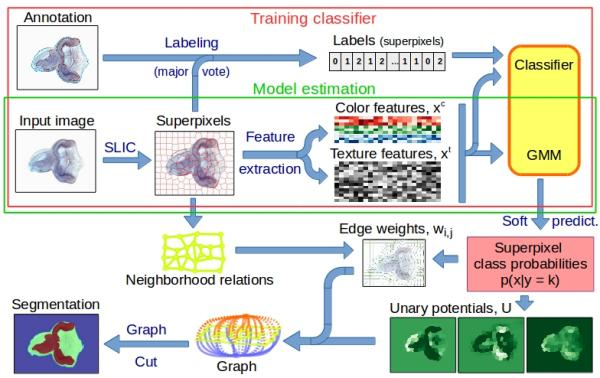

**Sample ipython notebooks:**
* [Supervised segmentation](notebooks/segment-2d_slic-fts-classif-gc.ipynb) requires training anottaion
* [Unsupervised segmentation](notebooks/segment-2d_slic-fts-model-gc.ipynb) just asks for expected number of classes
* **partially annotated images** with missing annotatio is marked by a negative number

**Illustration**

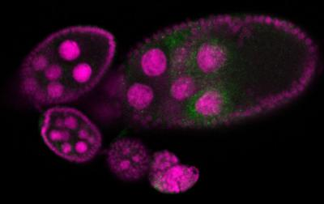
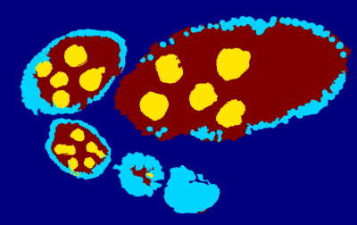

Borovec J., Svihlik J., Kybic J., Habart D. (2017). **Supervised and unsupervised segmentation using superpixels, model estimation, and Graph Cut.** In: Journal of Electronic Imaging.


## Object centre detection and Ellipse approximation

An image processing pipeline to detect and localize Drosophila egg chambers that consists of the following steps: (i) superpixel-based image segmentation into relevant tissue classes (see above); (ii) detection of egg center candidates using label histograms and ray features; (iii) clustering of center candidates and; (iv) area-based maximum likelihood ellipse model fitting. See our [Poster](http://cmp.felk.cvut.cz/~borovji3/documents/poster-MLMI2017.compressed.pdf) related to this work.

**Sample ipython notebooks:**
* [Center detection](notebooks/egg-center_candidates-clustering.ipynb) consists of center candidate training and prediction, and candidate clustering.
* [Ellipse fitting](notebooks/egg-detect_ellipse-fitting.ipynb) with given estimated center structure segmentation.

**Illustration**

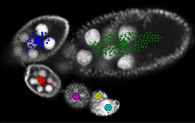
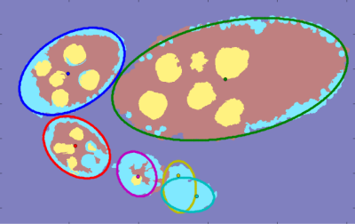

Borovec J., Kybic J., Nava R. (2017) **Detection and Localization of Drosophila Egg Chambers in Microscopy Images.** In: Machine Learning in Medical Imaging.

## Superpixel Region Growing with Shape prior

Region growing is a classical image segmentation method based on hierarchical region aggregation using local similarity rules. Our proposed approach differs from standard region growing in three essential aspects. First, it works on the level of superpixels instead of pixels, which leads to a substantial speedup. Second, our method uses learned statistical shape properties which encourage growing leading to plausible shapes. In particular, we use ray features to describe the object boundary. Third, our method can segment multiple objects and ensure that the segmentations do not overlap. The problem is represented as an energy minimization and is solved either greedily, or iteratively using GraphCuts.

**Sample ipython notebooks:**
* [General GraphCut](notebooks/egg_segment_graphcut.ipynb) from given centers and initial structure segmentation.
* [Shape modeling](notebooks/RG2Sp_shape-models.ipynb) estimation from training examples.
* [Region growing](notebooks/RG2Sp_region-growing.ipynb) from given centers and initial structure segmentation with shape models.

**Illustration**

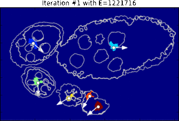
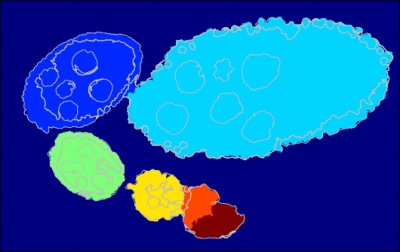

Borovec J., Kybic J., Sugimoto, A. (2017). **Region growing using superpixels with learned shape prior.** In: Journal of Electronic Imaging.

---

## Installation and configuration

**Configure local environment**

Create your own local environment, for more see the [User Guide](https://pip.pypa.io/en/latest/user_guide.html), and install dependencies requirements.txt contains list of packages and can be installed as
```
@duda:~$ cd pyImSegm  
@duda:~/pyImSegm$ virtualenv env
@duda:~/pyImSegm$ source env/bin/activate  
(env)@duda:~/pyImSegm$ pip install -r requirements.txt  
(env)@duda:~/pyImSegm$ python ...
```
and in the end terminating...
```
(env)@duda:~/pyImSegm$ deactivate
```

Moreover, we are using python [GraphCut wrapper](https://github.com/Borda/pyGCO) which require to be installed separately (not yet integrated in PIP)
```
(env)@duda:~/pyImSegm$ mkdir libs && cd libs
(env)@duda:~/pyImSegm$ git clone https://github.com/Borda/pyGCO.git
(env)@duda:~/pyImSegm$ pip install -r requirements.txt
(env)@duda:~/pyImSegm$ python setup.py install
```

**Compilation**

We have implemented cython version of some functions, especially computing descriptors, which require to compile them before using them
```
python setup.py build_ext --inplace
```
If loading of compiled descriptors in cython fails, it is automatically swapped to numpy which gives the same results, but it is significantly slower.

---


## Experiments

Short description of our three sets of experiments that together compose single image processing pipeline in this order:

1. **Structure segmentation**
1. **Center detection (and ellipse fitting)**
1. **Region growing with a shape prior**


### Annotation tools

We introduce some useful tools for work with image annotation and segmentation.

* In case you have some smooth color labeling in your images you can remove them with following quantization script.
    ```
    python handling_annotations/run_image_color_quantization.py \
        -imgs "images/drosophila_ovary_slice/segm_rgb/*.png" \
        -m position -thr 0.01 --nb_jobs 2
    ```
* Concerting image labels into colour space and other way around.
    ```
    python handling_annotations/run_image_convert_label_color.py \
        -imgs "images/drosophila_ovary_slice/segm/*.png" \
        -out images/drosophila_ovary_slice/segm_rgb
    ```
* Having input image and its segmentation we can use simple visualisation which overlap the segmentation over input image. 
    ```
    python handling_annotations/run_overlap_images_segms.py \
        -imgs "images/drosophila_ovary_slice/image/*.jpg" \
        -segs images/drosophila_ovary_slice/segm \
        -out results/overlap_ovary_segment
    ```
* Inpainting selected labels in segmentation.
    ```
    python handling_annotations/run_segm_annot_inpaint.py \
        -imgs "images/drosophila_ovary_slice/segm/*.png" \
        --label 4
    ```
* Change labels in input segmentation into another set of lables in 1:1 schema.
    ```
    python handling_annotations/run_segm_annot_relabel.py \
        -imgs "images/drosophila_ovary_slice/center_levels/*.png" \
        -out results/relabel_center_levels \
        --label_old 2 3 --label_new 1 1 
    ```


### Structure segmentation

We utilize (un)supervised segmentation according to given training examples or some expectations.

* Evaluate superpixels (with given SLIC parameters) quality against given segmentation. It helps find out best SLIC configuration.
    ```
    python experiments_segmentation/run_eval_superpixels.py \
        -imgs "images/drosophila_ovary_slice/image/*.jpg" \
        -segm "images/drosophila_ovary_slice/annot_eggs/*.png" \
        --img_type 2d_gray \
        --slic_size 20 --slic_regul 0.25 --slico 0
    ```
* Perform **Unsupervised** segmentation.
    ```
    python experiments_segmentation/run_segm_slic_model_graphcut.py \
       -list images/langerhans_islets/list_lang-isl_imgs-annot.csv \
       -imgs "images/langerhans_islets/image/*.jpg" \
       -out results -n langIsl --nb_classes 3 --visual 1 --nb_jobs 2
    ```
* Perform **Supervised** segmentation with afterwards evaluation.
    ```
    python experiments_segmentation/run_segm_slic_classif_graphcut.py \
        -list images/drosophila_ovary_slice/list_imgs-annot-struct.csv \
        -imgs "images/drosophila_ovary_slice/image/*.jpg" \
        -out results -n Ovary --img_type 2d_gray --visual 1 --nb_jobs 2
    ```
* For both experiment you can evaluate segmentation results.
    ```
    python experiments_segmentation/run_compute-stat_annot-segm.py \
        -annot "images/drosophila_ovary_slice/annot_struct/*.png" \
        -segm "results/experiment_segm-supervise_ovary/*.png" \
        -img "images/drosophila_ovary_slice/image/*.jpg" \
        -out results/evaluation
    ```

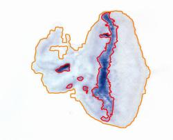
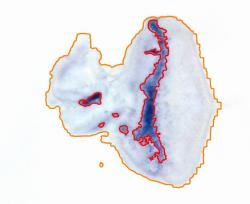

### Center detection and ellipse fitting

In general, the input is a formatted list (CSV file) of input images and annotations. Another option is set `-list none` and then the list is paired from given paths to images and annotations.

**Experiment sequence is following:**

1. We can create the annotation completely manually or use following script which uses annotation of individual objects and create the zones automatically.
    ```
    python experiments_ovary_centres/run_create_annotation.py
    ```
1. With zone annotation, we train a classifier for center candidate prediction. The annotation can be a CSV file with annotated centers as points, and the zone of positive examples is set uniformly as the circular neighborhood around these points. Another way (preferable) is to use annotated image with marked zones for positive, negative and neutral examples.
    ```
    python experiments_ovary_centres/run_center_candidate_training.py -list none \
        -segs "images/drosophila_ovary_slice/segm/*.png" \
        -imgs "images/drosophila_ovary_slice/image/*.jpg" \
        -centers "images/drosophila_ovary_slice/center_levels/*.png" \
        -out results -n ovary
    ```
1. Having trained classifier we perfom center prediction composed from two steps: i. center candidate clustering and candidate clustering.
    ```
    python experiments_ovary_centres/run_center_prediction.py -list none \
        -segs "images/drosophila_ovary_slice/segm/*.png" \
        -imgs "images/drosophila_ovary_slice/image/*.jpg" \
        -centers results/detect-centers-train_ovary/classifier_RandForest.pkl \
        -out results -n ovary
    ```
1. Assuming you have an expert annotation you can compute static such as missed eggs.
    ```
    python experiments_ovary_centres/run_center_evaluation.py
    ```
1. This is just cut out clustering in case you want to use different parameters.
    ```
    python experiments_ovary_centres/run_center_clustering.py
    ```
1. Matching the ellipses to the user annotation.
    ```
    python experiments_ovary_detect/run_ellipse_annot_match.py \
        -info "~/Medical-drosophila/all_ovary_image_info_for_prague.txt" \
        -ells "~/Medical-drosophila/RESULTS/3_ellipse_ransac_crit_params/*.csv" \
        -out ~/Medical-drosophila/RESULTS
    ```
1. Cut eggs by stages and norm to mean size.
    ```
    python experiments_ovary_detect/run_ellipse_cut_scale.py \
        -info ~/Medical-drosophila/RESULTS/info_ovary_images_ellipses.csv \
        -imgs "~/Medical-drosophila/RESULTS/0_input_images_png/*.png" \
        -out ~/Medical-drosophila/RESULTS/images_cut_ellipse_stages
    ```
1. Rotate (swap) extrated eggs according the larger mount of mass.
    ```
    python experiments_ovary_detect/run_egg_swap_orientation.py
    ```

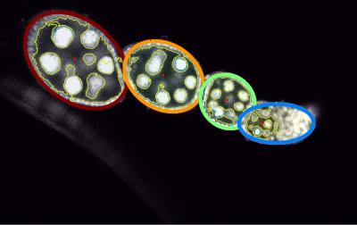

### Region growing with shape prior

In case you do not have estimated object centers, you can use [plugins](ij_macros) for landmarks import/export for [Fiji](http://fiji.sc/).

**Note:** install multi-snake package which is used in multi-method segmentation experiment.
```
cd libs 
git clone https://github.com/Borda/morph-snakes.git
cd morph-snakes 
pip install -r requirements.txt
python setup.py install
```

**Experiment sequence is following:**

1. Estimating shape model from set training images containing single egg annotation.
    ```
    python experiments_ovary_detect/run_RG2Sp_estim_shape-models.py  \
        -annot "~/Medical-drosophila/egg_segmentation/mask_2d_slice_complete_ind_egg/*.png" \
        -out data -nb 15
    ```
1. Run several segmentation techniques on each image.
    ```
    python experiments_ovary_detect/run_ovary_egg-segmentation.py  \
        -list images/drosophila_ovary_slice/list_imgs-segm-center-points.csv \
        -out output -n ovary_image --nb_jobs 1 \
        -m ellipse_moments \
           ellipse_ransac_mmt \
           ellipse_ransac_crit \
           GC_pixels-large \
           GC_pixels-shape \
           GC_slic-large \
           GC_slic-shape \
           rg2sp_greedy-mixture \
           rg2sp_GC-mixture \
           watershed_morph
    ```
1. Evaluate your segmentation results to expert annotation.
    ```
    python experiments_ovary_detect/run_ovary_segm_evaluation.py
    ```
1. In the end, cut individual segmented objects comes as minimal bounding box.
    ```
    python experiments_ovary_detect/run_cut_segmented_objects.py \
        -annot "images/drosophila_ovary_slice/annot_eggs/*.png" \
        -img "images/drosophila_ovary_slice/segm/*.png" \
        -out results/cut_images --padding 50
    ```
1. Finally, performing visualisation of segmentation results toghter with expert annotation.
    ```
    python experiments_ovary_detect/run_export_user-annot-segm.py
    ```
    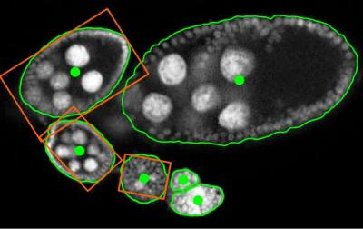

---


## References

For complete references see [BibTex](references.bib).
1. Borovec J., Svihlik J., Kybic J., Habart D. (2017). **Supervised and unsupervised segmentation using superpixels, model estimation, and Graph Cut.** SPIE Journal of Electronic Imaging 26(6), 061610, http://doi.org/10.1117/1.JEI.26.6.061610
1. Borovec J., Kybic J., Nava R. (2017) **Detection and Localization of Drosophila Egg Chambers in Microscopy Images.** In: Wang Q., Shi Y., Suk HI., Suzuki K. (eds) Machine Learning in Medical Imaging. MLMI 2017. LNCS, vol 10541. Springer, Cham. http://doi.org/10.1007/978-3-319-67389-9_3
1. Borovec J., Kybic J., Sugimoto, A. (2017). **Region growing using superpixels with learned shape prior.** SPIE Journal of Electronic Imaging 26(6),  061611, http://doi.org/10.1117/1.JEI.26.6.061611
